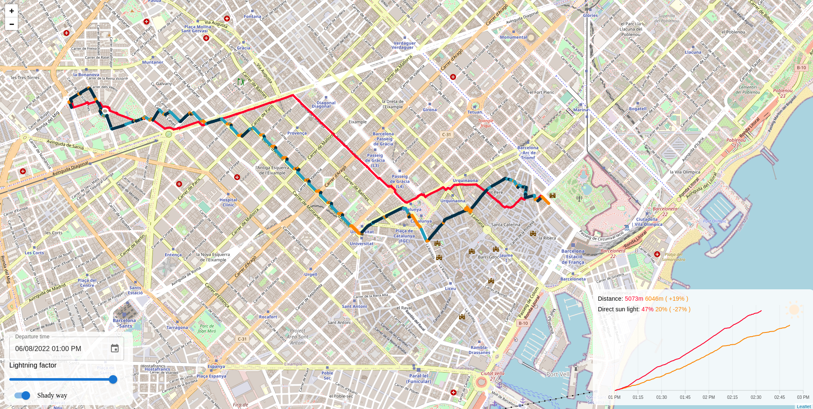

# SunnyWay

Service for pedestrian route planning that takes into account shadow and natural sunlight

> See [demo](https://way.rofleksey.ru/) for Barcelona



## Preparing graph

* Install `python3` and `pip`
* Run `pip install -r requirements.txt` in `converter` folder
* Download pre-exported map containing your region (e.g. from [here](https://download.geofabrik.de/))
* Download [osmconvert](https://wiki.openstreetmap.org/wiki/Osmconvert) and [osmfilter](https://wiki.openstreetmap.org/wiki/Osmfilter)
* Crop the region:
```bash
$ osmconvert compressed-map.osm.pbf -b=<area> --complete-ways --complete-
multipolygons -o=map-full.osm.
```
* Remove redundant objects from map:
```bash
$ osmfilter map-full.osm --keep 'highway= building= natural=
barrier=' --drop-relations -o=map.osm
```
* Put `map.osm` in `converter` directory
* Run `python3 converter.py` in that directory (will take 2-3 hours to complete for Barcelona)
* Move `converter/output.csv` to `sunny-way-api/data/edges.csv`

## Starting server locally

### Using existing Docker image

* Install `docker`
* Run `sudo docker run -p 8080:8080 -v $(pwd)/data:/opt/data rofleksey/sunny-way-api:latest` in `sunny-way-api` directory
* Visit `localhost:8080` in your browser

### Building Docker image yourself

* Install `docker`
* Run `sudo docker build -t <your_tag> --no-cache .` in `sunny-way-api` directory
* Run `sudo docker run -p 8080:8080 -v $(pwd)/data:/opt/data <your_tag>` in `sunny-way-api` directory
* Visit `localhost:8080` in your browser

### Manual start

* Install `Java 11 JDK` and `NodeJS 14+`
* Run `npm i --production` and `npm run build` in `ui` directory
* Run `./gradlew run` in `sunny-way-api` folder (Wait for `Netty started on port 8080` line to appear)
* Visit `localhost:8080` in your browser